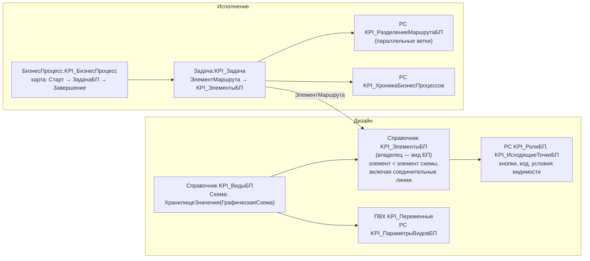

# Анализ прототипа: конструктор БП в «1С:Управление по целям и KPI 3.1»

| | |
|---|---|
| Источник | Выгрузка базы клиента ОТЭКО: `Configuration.xml` + архив `bp - builder.zip` (87 файлов, ~13 тыс. строк кода) |
| Конфигурация | «1С:Управление по целям и KPI, ред. 3.1», версия 3.1.1.1, фирма «Волгасофт-проект» |
| Режимы | Совместимость 8.3.20, совместимость расширений 8.5.1, интерфейс «Такси» |
| Что изучено | Справочники `KPI_ВидыБП`, `KPI_ЭлементыБП` (метаданные, формы, модули), `БизнесПроцесс.KPI_БизнесПроцесс` (карта маршрута, модули), `Задача.KPI_Задача`, модули `KPI_УправлениеБизнесПроцессами*`, обработка `KPI_АдминистрированиеБП` |
| Чего нет | Регистров (`KPI_ИсходящиеТочкиБП`, `KPI_РолиБП`, `KPI_ИсполнителиБП`, `KPI_РазделениеМаршрутаБП` …) — их структура восстановлена по запросам в коде. **Расширения «КонструкторБП»** (модуль `БП_БизнесПроцессСервер`), к которому обращается конфигурация (см. 2.4). |

Цель анализа — позаимствовать удачные **идеи**, а не повторять реализацию. Код вендора в репозиторий не копируется.

---

## 1. Как устроен прототип

### 1.1. Схема и элементы
- `KPI_ВидыБП.Схема` хранит `ГрафическаяСхема` в `ХранилищеЗначения`. Форма вида БП содержит поле `ГрафическаяСхема` с командами вставки элементов (Старт, Завершение, Действие, Условие, ВыборВарианта, Разделение, Слияние, Обработка, ВложенныйБизнесПроцесс, Декорация, ДекоративнаяЛиния) и выравнивания. Кнопка «Редактировать» переключает `Элементы.СхемаБП.Редактирование`.
- **Каждый элемент схемы, включая соединительные линии и варианты «Выбора варианта», — элемент справочника `KPI_ЭлементыБП`** (владелец — вид БП). У линии — реквизиты `НачалоЭлемент`, `КонецЭлемент`, `НачалоВариант`, `КонецВариант`.
- Связь схемы и справочника — **по строке**: `Имя` элемента схемы = `Наименование` элемента справочника (`НайтиПоНаименованию`).
- Двойной клик по элементу схемы (событие `Выбор`, `Элемент.ТекущийЭлемент.Имя`) открывает карточку элемента справочника со всеми настройками шага.
- **Синхронизация схемы и справочника — ручная.** Отдельная форма сравнивает таблицы «по схеме» и «в справочнике» (`ПолучитьСравнительнуюТаблицуЭлементовБП`), пользователь отмечает строки «Исправить» (`ИсправитьДанныеНаСервере`).
- **Версий нет.** Схема и элементы правятся «вживую», изменения сразу касаются работающих процессов.
- Выгрузка: `.grs` (графическая схема) + XML с настройками. Есть форма копирования вида БП со всеми элементами и регистрами.

### 1.2. Настройки шага (`KPI_ЭлементыБП`)
Инструкция пользователю; представление задачи; **групповая** задача; **завершать автоматически** (через N дней после срока); **принимать к исполнению** + текст кнопки принятия; срок «выполнить до» (в днях с учётом графика работы); исполнители из группы структур или **из параметра задачи предыдущего этапа**; вложенный БП + способ заполнения адресации (мин/макс уровень адресации); «при выполнении завершить указанный этап»; шаблон сообщения БСП; **«учитывать в хронологии как возврат»**.

Табличные части: `ОбработчикиСобытий` (имя события + **код на встроенном языке**), `ВариантыУсловий`, `ВходящиеТочки`, `ИсходящиеТочки` (+ признак «вариант учитывать как возврат»), `ДоступныеОтчетыВФормеЗадачи`.

Для каждого типа элемента задан набор событий с шаблоном кода и описанием переменных (`СобытияЭлементаБП`): `ПередСтартом` (Отказ, Параметры), `ПроверкаУсловия` (Результат) и т. д. Код правится в отдельной форме-редакторе.

### 1.3. Исполнение
- **Один платформенный бизнес-процесс-«носитель»** `KPI_БизнесПроцесс` с картой из трёх точек: `Старт → ЗадачаБП → Завершение`. Реальный маршрут ведёт код, который по `ЭлементМаршрута` задачи ищет следующий элемент.
- Задачи — платформенная `Задача.KPI_Задача` с адресацией по регистру `KPI_ГруппыСтруктур` (объект управления, группа структур, подразделение).
- Параллельность: регистр `KPI_РазделениеМаршрутаБП` (точка разделения, ветка, «активное разделение»). Слияние продолжает маршрут, когда по разделителю не осталось активных веток. По сути это счётчик маркеров.
- Переменные: ПВХ `KPI_Переменные`, постоянные параметры вида — в ТЧ процесса и регистрах. `ПолучитьСтруктуруПараметровБП` / `ЗаписатьПараметрыБП` сохраняют изменения, которые сделал пользовательский код.
- Хроника процесса: `KPI_ХроникаБизнесПроцессов`.

### 1.4. Кнопки
- Кнопки шагов описаны в регистрах `KPI_РолиБП` и `KPI_ИсходящиеТочкиБП`: `ИмяКнопки`, `НадписьКнопки`, `ПоказыватьКнопку`, **`ПоказыватьПоУсловию` (строка кода)**, **`КодМодуля`**, «открыть интерактивную форму для ввода».
- `Форма_ОпределитьКнопкиФормы` при открытии формы объекта или задачи находит активные задачи по объекту (`KPI_ЗадачиОбъектовБП`) и создаёт команды и кнопки (`Форма.Команды.Добавить`, `Форма.Элементы.Добавить`) с общим обработчиком `ОбработчикКоманды_Подключаемый`. **Кнопки выводятся в группу `КоманднаяПанель_БП`, которая должна заранее существовать в форме.**
- При нажатии `ОбработатьДействиеКомандыБП` выполняет `КодМодуля` кнопки через `Выполнить(...)`, сохраняет изменённые параметры и завершает задачу с продолжением маршрута. Если включена настройка, остальные задачи этапа при принятии к исполнению закрываются (`ВыполнитьВсеЗадачиПоТочке`).
- Форма `ФормаВыбораВариантаПродолженияМаршрута` — диалог выбора ветки и **исполнителя следующего этапа**.

### 1.5. Адресация и замещение
- Исполнители шага: `KPI_ИсполнителиБП` (по экземпляру) → если пусто, настройки по умолчанию `KPI_РолиБП` (по виду БП и действию).
- «Динамические роли» — предопределённые элементы `KPI_ГруппыСтруктур`: `НепосредственныйРуководитель`, `ИнициаторБП`, `АвторДокумента`, `АвторУтверждения`, `АвторПроверки`, `АвторБлокирования`, `ОбъектУправления`. Их вычисление **зашито под документы KPI** (`Параметры.ДокументСмартЗадача`, `Параметры.ДокументПланирования`).
- `KPI_ДублироватьЗадачуБП` — замена или дублирование исполнителя по виду БП и действию.
- Замещение: документ `KPI_ПриказОЗамещении` + регистр `KPI_Замещение` + регламентное задание. **Учёт замещения в самой функции адресации закомментирован.**

### 1.6. Оповещения
Интеграция с БСП «Шаблоны сообщений»: у задачи есть макет `ДанныеШаблонаСообщений`, в модуле менеджера — `ПриПодготовкеШаблонаСообщения` и `ПриФормированииСообщения`. Письма группируются (документ `KPI_ГруппировкаОповещенийБП`, способ группировки, период), уходят через очередь («стек») регламентным заданием.

---

## 2. Слабые места прототипа (чего избегаем)

| № | Проблема (подтверждено кодом) | Последствие | Наше решение |
|---|---|---|---|
| С-1 | **Маршруты предопределённых видов зашиты в код**: `ПродолжитьМаршрутБППредопределенный` содержит ветки `Если ВидБП = Справочники.KPI_ВидыБП.SmartЗадачи … Наименование = "ДействиеУтверждение"`; разделение и слияние ищут элементы по именам `"УсловиеПроверятьСмартЗадачи"`, `"Слияние1"` | Правка схемы в конструкторе не меняет поведение; конструктор и код расходятся | Движок не знает ни одной конкретной схемы; типовые процессы — эталонные JSON-схемы (`examples/`) |
| С-2 | Связь схемы и справочника **по наименованию**, синхронизация **ручная** | Переименовал элемент — потерял настройки; забыл «Исправить» — рассинхрон | Неизменяемый `ИдЭлемента`; автоматическая синхронизация при записи черновика (Архитектура п. 4.1) |
| С-3 | **Нет версий** схемы | Правка ломает запущенные процессы | Версии; опубликованная неизменяема (АР-4) |
| С-4 | Пользовательский код через **`Выполнить()` без безопасного режима** — 4 места, включая условие видимости кнопки, которое вычисляется при каждом открытии формы | Любой методолог выполняет произвольный код с правами сервера; ошибки рушат открытие форм | До этапа 6 — только зарегистрированные обработчики; дальше — безопасный режим + отдельное право (АР-8) |
| С-5 | Кнопки требуют группу **`КоманднаяПанель_БП` в каждой форме** объекта | Правка типовых форм → снятие с поддержки | Программная панель через подключаемые команды БСП (ФТ-409) |
| С-6 | **Движок разделён** между конфигурацией и отдельным расширением (`ПроверитьПодключениеРасширенияКонструкторБП` → `БП_БизнесПроцессСервер.ОбработкаСобытий`) | Два места логики, поведение зависит от наличия расширения | Один движок в одном расширении |
| С-7 | Платформенный БП-«носитель» (`Старт → ЗадачаБП → Завершение`) + свой маршрут в справочниках | Две модели состояния, платформенные механизмы работают вхолостую | Собственный движок на маркерах (АР-2, АР-5) |
| С-8 | Динамические роли **зашиты под документы продукта** | Не переносится в другие конфигурации | Способы адресации + адаптер + переопределяемый модуль (п. 7) |
| С-9 | **Монолит**: `KPI_УправлениеБизнесПроцессамиСерверВызовСервера` — 4100 строк, вся логика в модуле с флагом «вызов сервера» | Любая экспортная функция движка доступна с клиента; модуль тяжело сопровождать | Разделение на модули по п. 2 архитектуры; клиенту доступен только `кбп_ПроцессыAPI` |
| С-10 | **Слабая проверка схемы**: `ЕстьОшибкиСхемыБП` проверяет только дубли имён и наличие ветки «Да» у условий | Ошибки маршрута обнаруживаются на работающих процессах | Полная проверка графа при публикации (ФТ-105) |
| С-11 | Код под конкретных клиентов в модулях продукта (`…СерверПросвещение`, `KPI_Русклимат`) | Обновление продукта конфликтует с доработками | Точки расширения + доработки в расширении клиента |
| С-12 | Учёт замещения в адресации закомментирован, есть объекты `Удалить_*` | Функциональность «на полпути» | Замещение проверяется при чтении списка задач (п. 7) |

## 3. Что берём (идеи, реализация своя)

| № | Идея | Куда внесено |
|---|---|---|
| И-1 | Шаги схемы — **элементы справочника**, остальные настройки — в **регистрах** | Архитектура п. 4.1: `кбп_ЭлементыСхем` + регистры `кбп_ПереходыСхем`, `кбп_КнопкиШагов`, `кбп_ИсполнителиШагов`, `кбп_ОповещенияШагов` |
| И-2 | **Переменные через ПВХ** | Архитектура п. 4.1: `ПВХ.кбп_ПеременныеПроцессов`; ТЧ `Переменные` процесса — Характеристика |
| И-3 | **Замещение документом** | Архитектура п. 4.2: `Документ.кбп_Замещение`; ТЗ ФТ-304 |
| И-4 | **«Взять в работу»** снимает задачи у остальных | ТЗ ФТ-411; Архитектура п. 6.2 |
| И-5 | **Группировка оповещений** (дайджест) | ТЗ ФТ-608; Архитектура п. 9 |
| И-6 | **Копии задачи** для сведения | ТЗ ФТ-412 |
| И-7 | **Исключения** из автозапуска, запрет второго экземпляра по тому же предмету | ТЗ ФТ-108 |
| И-8 | **Автовыполнение** просроченных задач | ТЗ ФТ-308 |
| И-9 | **Постоянные параметры** схемы | Архитектура п. 4.1: `кбп_ПараметрыСхем` |
| И-10 | Оповещения **в интерфейсе** 1С | ТЗ ФТ-609; Архитектура п. 9 |
| И-11 | **Подтверждённое API `ГрафическаяСхема`**: свойства линий `НачалоЭлемент/КонецЭлемент/НачалоВариант/КонецВариант`, варианты `ВыборВарианта.Элементы`, событие `Выбор`, режим `Редактирование` | Архитектура п. 5.1; риск понижен |
| И-12 | Выбор **исполнителя следующего шага** в диалоге при выполнении | ТЗ ФТ-303, ФТ-413 |
| И-13 | **Отчёты в форме задачи** | ТЗ ФТ-414 |
| И-14 | **Шаблоны сообщений БСП** для оповещений | Архитектура п. 4.1 (через адаптер) |
| И-15 | «При выполнении шага **завершить другой шаг**» | ТЗ ФТ-410 |
| И-16 | Стрелка назад на схеме с признаком **«это возврат»** для статистики | Архитектура п. 4.1, `кбп_ПереходыСхем` |
| И-17 | **Информационная строка** с переменными в задаче | ТЗ ФТ-402 |
| И-18 | Для типа элемента задан **список событий с описанием доступных переменных** | Использовать в этапе 6: редактор кода и регистрация обработчиков получают описание контекста для каждого события |

## 4. Статус

Согласованные правки (п. 4 предыдущей версии анализа) внесены в [ТЗ](ТЗ.md) (версия 0.3) и [Архитектуру](Архитектура.md). Дополнительного материала для анализа не требуется. Расширение «КонструкторБП» могло бы показать универсальную часть движка, но для наших решений оно не критично.
