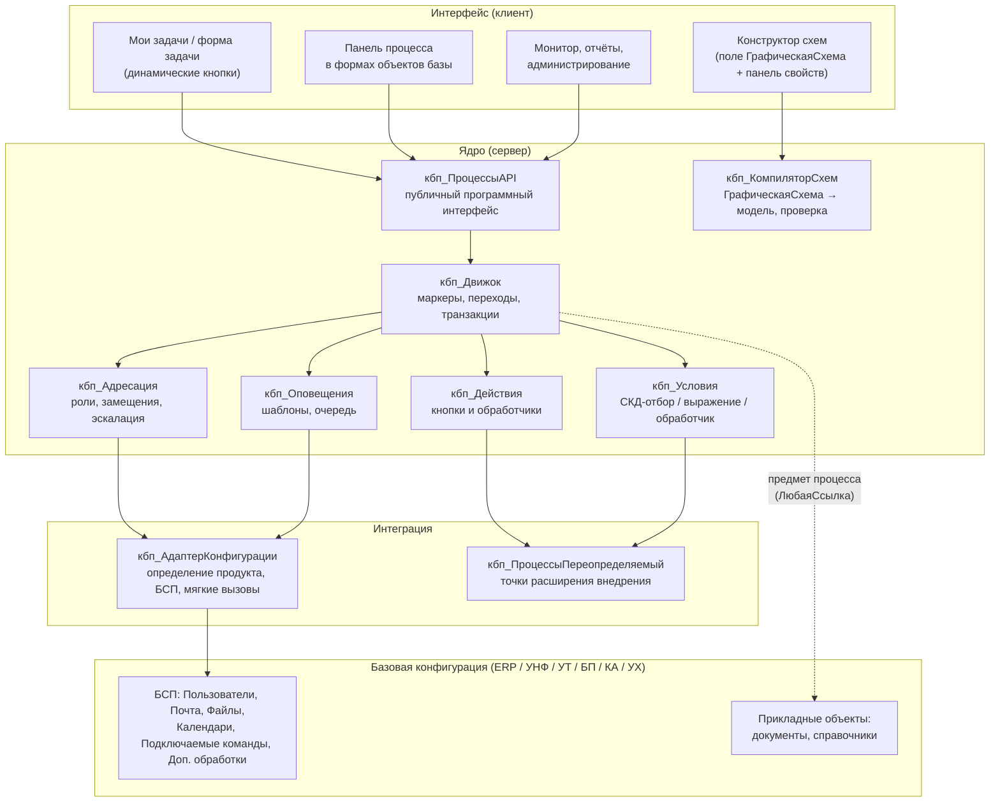
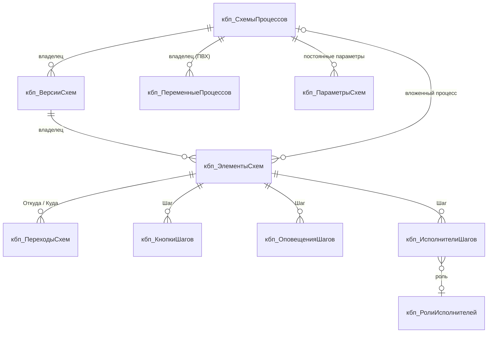
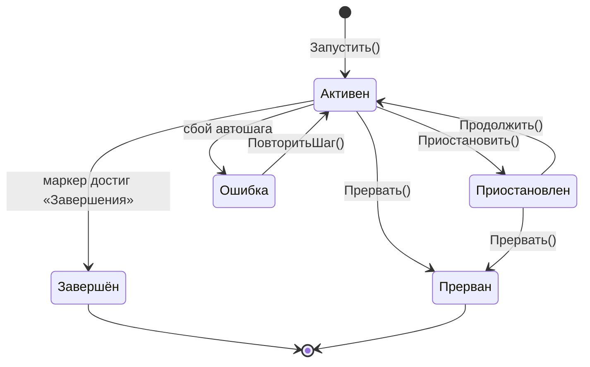
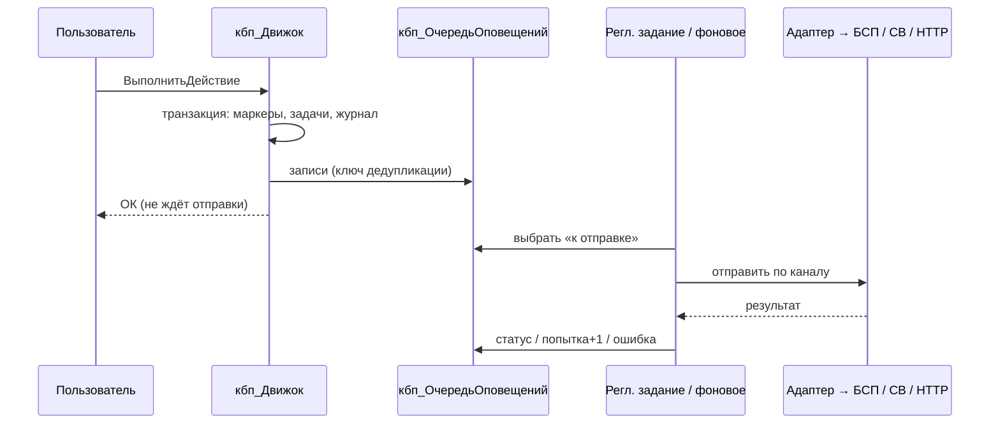

# Архитектура
## «Конструктор бизнес-процессов» (префикс объектов `кбп_`)

Документ описывает, **как** выполняются требования [ТЗ](ТЗ.md). Номера ФТ/НФ ссылаются на ТЗ.

---

## 1. Ключевые архитектурные решения

| № | Решение | Почему | Альтернатива и почему отвергнута |
|---|---|---|---|
| АР-1 | Поставка — **расширение конфигурации** (назначение «Дополнение») | Одно расширение ставится в ERP, УНФ, УТ, БП, КА, УХ без снятия с поддержки (НФ-01, НФ-08). | Встраиваемая подсистема (объединение конфигураций): для каждого продукта отдельное сравнение и объединение, типовая снимается с поддержки. |
| АР-2 | **Собственный движок процессов**, платформенные `БизнесПроцесс` и `Задача` не используются | Карта маршрута платформенного бизнес-процесса правится только в конфигураторе, а по ТЗ схему рисует пользователь (ФТ-101). Платформенный маршрут статичен, вложенность и возвраты делаются кодом. | Платформенные БП: не выполняют главное требование. |
| АР-3 | Схема хранится **двумя представлениями**: визуальная (`ГрафическаяСхема`) и **модель маршрута** (шаги и переходы в табличных частях). Источник истины — модель. **Решено:** редактор — `ГрафическаяСхема`; все настройки — только в справочниках и регистрах, схема хранит лишь картинку и имена элементов. | Движок не зависит от внутреннего устройства объекта `ГрафическаяСхема` и работает быстро (обычные запросы). Схему можно выгрузить в JSON (ФТ-107). | Исполнять напрямую по `ГрафическаяСхема`: медленно, без запросов, зависимость от API объекта. |
| АР-4 | **Опубликованная версия неизменяема**, экземпляр ссылается на версию | Правка схемы не ломает работающие процессы (ФТ-106). | Ссылка на «живую» схему: сломанные процессы после правки. |
| АР-5 | Модель исполнения — **маркеры (tokens)** | Естественно даёт параллельные ветки, слияния «N из M», вложенность, возвраты (ФТ-102, ФТ-404, ФТ-7xx). | Одно поле «ТекущийШаг»: не выражает параллельность. |
| АР-6 | **Адаптер базовой конфигурации** — единственное место, которое знает про ERP/УТ/БП и БСП | Всё остальное пишется один раз (НФ-01). | Условия `Если ЭтоERP` по всему коду: неподдерживаемо. |
| АР-7 | Всё медленное и внешнее (почта, вебхуки, тяжёлые обработчики, эскалации) — **асинхронно через очереди** и регламентные задания | Выполнение задачи не ждёт SMTP, есть повторы и нет дублей (ФТ-606, НФ-05). | Синхронная отправка: тормозит и роняет транзакцию. |
| АР-8 | Расширяемость для внедренцев — **переопределяемые модули и регистрация обработчиков**. Произвольный код и конструктор действий — этап 6, за отдельным правом | Безопасность и сопровождаемость (НФ-06, ФТ-503). | Только произвольный код: небезопасно, не отлаживается. |
| АР-9 | Отложенные направления (лицензирование, интеграции, мобильный клиент, Фреш, 8.5) **не реализуются, но им оставлены точки входа** | Ядро не придётся переделывать (п. 10.1). | Делать всё сразу: MVP не выйдет. Не думать заранее: переделка ядра. |

---

## 2. Логическая схема



Правило зависимостей: **UI → API → Движок → сервисы → Адаптер → База**. Формы не обращаются к регистрам напрямую, сервисы не обращаются к БСП в обход адаптера.

---

## 3. Взаимодействие с базовой конфигурацией

### 3.1. Заимствованные объекты (минимальный набор)
Каждое заимствование — риск несовместимости с одной из 6 конфигураций, поэтому набор минимален и одинаков для всех:

| Объект | Зачем |
|---|---|
| `Справочник.Пользователи` | Исполнители, авторы, замещения. Есть во всех 6 (БСП). |
| `ОбщийМодуль.ПодключаемыеКомандыПереопределяемый` | Команды «Запустить процесс» и панель процесса в формах любых объектов без заимствования самих форм (ФТ-408). |
| `ОбщийМодуль.ОбновлениеИнформационнойБазыПереопределяемый` *(или аналог для расширений)* | Регистрация обработчиков обновления данных расширения (НФ-08). |
| Роли профилей групп доступа *(через `УправлениеДоступомПереопределяемый`)* | Поставка профилей «Участник процессов», «Методолог», «Администратор процессов». |

Принципы:
- **Формы объектов базы не заимствуются.** Встраивание — через подключаемые команды БСП и, где нужно, через программное добавление элементов в общий обработчик `ПриСозданииНаСервере` (подключаемые команды это позволяют).
- Ссылки на прикладные объекты хранятся в реквизитах типа **`ЛюбаяСсылка`**, поэтому заимствовать документы не нужно.
- Режим сопоставления заимствованных объектов — **по именам**, а не по внутренним идентификаторам: у ERP и БП разные UUID одних и тех же объектов БСП.

### 3.2. Адаптер `кбп_АдаптерКонфигурации`
Единственный модуль, который знает о различиях продуктов.

```
ТекущийПродукт()                // "ERP" | "УНФ" | "УТ" | "БП" | "КА" | "УХ" | "Другое" — по Метаданные.Имя
ПодсистемаСуществует(Имя)      // обёртка над ОбщегоНазначения.ПодсистемаСуществует
ОтправитьПочту(Письмо)         // РаботаСПочтовымиСообщениями, если есть
РуководительПользователя(П)    // ERP/КА/УХ: структура предприятия; УНФ: сотрудники; БП: нет → Неопределено
ПроизводственныйКалендарь()    // БСП «Календарные графики»
ДобавитьРабочиеЧасы(Дата, Ч)   // срок с учётом календаря, иначе календарные часы
ТипыОбъектовДляПроцессов()     // документы, справочники, задачи, бизнес-процессы из Метаданные
ПредставлениеОбъекта(Ссылка)
```

Каждый метод при отсутствии возможности возвращает деградированный, но корректный результат. Специфика продукта раскладывается по функциям `РуководительПользователя_ERP()` и т. п. внутри адаптера.

---

## 4. Модель данных

### 4.1. Схемы (дизайн-время)

Все настройки схемы хранятся в **справочниках и регистрах** в разрезе версии схемы. Табличных частей с моделью маршрута нет. `ГрафическаяСхема` — только визуальное представление (решение п. 15.3, идея И-1 из [анализа прототипа](АнализПрототипа.md)).



| Объект | Тип | Содержание |
|---|---|---|
| `кбп_СхемыПроцессов` | Справочник (иерархия групп) | Карточка схемы: наименование, тип предмета (полное имя метаданных), текущая опубликованная версия, черновик, ответственный методолог, «не запускать второй экземпляр по тому же предмету». |
| `кбп_ВерсииСхем` | Справочник, владелец — схема | Номер версии, статус (Черновик / Опубликована / Архив), автор, дата публикации, **`ГрафическаяСхема`** в `ХранилищеЗначения` (только картинка). |
| `кбп_ЭлементыСхем` | Справочник, владелец — версия | **Один элемент справочника = один элемент графической схемы** (шаг или вариант «Выбора варианта»). `ИдЭлемента` (= `Имя` элемента схемы, неизменяемый GUID), `ТипШага`, наименование, инструкция исполнителю, срок (значение + единица + календарь), режим «каждому / любому» + «взять в работу», разрешён возврат и куда, «копии для сведения», вложенная схема и режим, режим слияния, таймер, действие при просрочке, «при выполнении завершить шаг …», поля к заполнению (ТЧ), отчёты в форме задачи (ТЧ). |
| `кбп_ПереходыСхем` | Регистр сведений | **Версия**, **ИдПерехода** (= `Имя` соединительной линии) → `Откуда`, `Куда` (`кбп_ЭлементыСхем`), `Вариант` (для «Выбора варианта»), порядок, «по умолчанию», **«это возврат»** (стрелка назад на схеме учитывается в статистике как возврат), вид условия, условие (СКД-отбор в хранилище), `ИдКнопки`. |
| `кбп_КнопкиШагов` | Регистр сведений | **Шаг**, **ИдКнопки** → заголовок, картинка, порядок, вид (основная / обычная / опасная), подтверждение, комментарий обязателен, условие видимости (СКД-отбор), действие, обработчик. |
| `кбп_ИсполнителиШагов` | Регистр сведений | **Шаг**, **НомерСтроки** → способ адресации, роль, путь к объектам адресации, пользователь, реквизит предмета, обработчик, «исполнителя выбирает исполнитель предыдущего шага». |
| `кбп_ОповещенияШагов` | Регистр сведений | **Версия**, **Шаг** (пусто = на весь процесс), **Событие**, **НомерСтроки** → получатели, каналы, шаблон, условие. |
| `ПВХ.кбп_ПеременныеПроцессов` | План видов характеристик, владелец — схема | Типизированные переменные: имя, тип значения (выбирается в пользовательском режиме), значение по умолчанию, вход / выход, «показывать в задаче». Переменные относятся к **схеме**, а не к версии. Удаление переменной, которая используется в опубликованной версии, запрещено. |
| `кбп_ПараметрыСхем` | Регистр сведений | **Схема**, **Параметр** (ПВХ) → значение. Постоянные параметры (например, лимит суммы), меняются **без** новой версии (И-9). |
| `кбп_ШаблоныСообщений` | Справочник | Тексты оповещений по каналам. Если в базе есть подсистема БСП «Шаблоны сообщений», адаптер позволяет использовать её шаблоны. |
| `кбп_Настройки` | Регистр сведений | **Ключ** → значение (хранилище). Настройки продукта вместо десятков констант. |

**Публикация.** Черновик — это обычная версия со статусом «Черновик», её элементы и записи регистров редактируются. Публикация = проверка + смена статуса. «Изменить опубликованную» = **копирование** версии со всеми элементами и записями регистров в новый черновик. У работающих экземпляров ссылки на элементы старой версии остаются валидными. Хранится полная модель, а не разница с предыдущей версией.

**Синхронизация схемы и справочника — автоматическая** при записи черновика (у прототипа — ручная форма сравнения, см. анализ): новый элемент на схеме → создаётся элемент справочника; удалён со схемы → помечается на удаление (если нет ссылок) или помечается «нет на схеме»; соединительная линия → запись `кбп_ПереходыСхем`. Связь по неизменяемому `ИдЭлемента`, а не по наименованию.

### 4.2. Ролевая модель

| Объект | Тип | Измерения / реквизиты |
|---|---|---|
| `кбп_РолиИсполнителей` | Справочник | Наименование; `ТипОбъектаАдресации1`, `ТипОбъектаАдресации2` (`ОписаниеТипов`); эскалационная роль; «использовать без объектов адресации». |
| `кбп_ИсполнителиРолей` | Регистр сведений | **Роль**, **ОбъектАдресации1** (ЛюбаяСсылка), **ОбъектАдресации2**, **Пользователь** → основной (булево), порядок. |
| `Документ.кбп_Замещение` | Документ | Замещаемый, замещающий, период, область действия (все / роли / схемы — ТЧ), основание, «уведомлять», «вернуть задачи по окончании», комментарий. **Проведение** формирует движения, отмена проведения их снимает. Аудит замещений — журнал документов (И-3). |
| `кбп_Замещения` | Регистр сведений, **подчинён регистратору** `кбп_Замещение` | **Замещаемый**, **Замещающий**, **Роль**, **Схема** → ДатаНачала, ДатаОкончания, уведомлять, возвращать задачи. |

### 4.3. Время выполнения

| Объект | Тип | Содержание |
|---|---|---|
| `кбп_Процессы` | Справочник | Экземпляр: версия схемы, предмет (**ЛюбаяСсылка**), автор, состояние, даты старта и завершения, **родительский процесс**, **шаг родителя**, **корневой процесс**, **уровень вложенности**, наблюдатели (ТЧ), **переменные (ТЧ: `Переменная` — ПВХ `кбп_ПеременныеПроцессов`, `Значение` — Характеристика)**. |
| `кбп_Задачи` | Справочник | Процесс, `Шаг` (`кбп_ЭлементыСхем`), `ИдМаркера`, «принята к исполнению» (кем, когда), **назначенный** исполнитель, **роль + объекты адресации**, **фактический** исполнитель, замещение-основание, состояние, срок, дата выполнения, результат (`ИдКнопки`), итерация (счётчик возвратов). |
| `кбп_Маркеры` | Регистр сведений | **Процесс**, **ИдМаркера** → `Шаг`, состояние (Активен / Ожидает / Завершён), родительский маркер (для разделения), ветка, итерация. |
| `кбп_ЖурналПроцессов` | Регистр сведений (независимый, непериодический) | **Процесс**, **Момент** (дата + счётчик), вид события, шаг, задача, пользователь, «за кого», кнопка, комментарий, данные (JSON). Единая лента для истории и комментариев (ФТ-405, ФТ-802). |
| `кбп_ОчередьДействий` | Регистр сведений | Отложенные действия движка: автошаги, таймеры, эскалации, запуск по расписанию. **Ид** → вид, процесс, маркер, «выполнить после», попытки, последняя ошибка. |
| `кбп_ОчередьОповещений` | Регистр сведений | **Ид** → канал, получатель, тема, текст, ссылка, ключ дедупликации, статус, попытки, ошибка. |
| `кбп_ПодпискиПользователей` | Регистр сведений | **Пользователь**, **Событие** → каналы, отключено. |
| `кбп_ПравилаЗапуска` | Регистр сведений | **ТипПредмета**, **Схема** → событие (запись / проведение), условие. Кэш для быстрой проверки при записи объектов. |

### 4.4. Перечисления
`кбп_ТипыШагов` (Старт, Задача, Условие, ВыборВарианта, Вариант, Разделение, Слияние, Обработка, ВложенныйПроцесс, Таймер, Оповещение, Завершение, Декорация), `кбп_СостоянияПроцессов` (Черновик, Активен, Приостановлен, Завершён, Прерван, Ошибка), `кбп_СостоянияЗадач` (Ожидает, ВРаботе, Выполнена, Возвращена, Отменена, Переадресована), `кбп_СпособыАдресации`, `кбп_ВидыУсловий` (Нет, Отбор, Выражение, Обработчик), `кбп_ВидыДействий`, `кбп_ВидыОбработчиков` (Зарегистрированный; Код и ДопОбработка — этап 6), `кбп_СобытияПроцессов`, `кбп_КаналыОповещений`, `кбп_РежимыСлияния` (Все, Любая, NизM), `кбп_РежимыВложенногоПроцесса` (Синхронно, Асинхронно), `кбп_ДействияПриПросрочке` (Ничего, Эскалация, Автовыполнение), `кбп_СпособыГруппировкиОповещений` (Сразу, РазВNМинут, РазВДень).

---

## 5. Конструктор схем

### 5.1. Редактор
Обработка `кбп_КонструкторСхем`, форма которой содержит:
- поле `ГрафическаяСхема`, редактируемое в пользовательском режиме;
- палитру элементов (типы из ФТ-102);
- панель свойств выбранного элемента: страницы «Основное», «Исполнители», «Кнопки», «Условия», «Оповещения», «Поля»;
- панель ошибок проверки.

**Связь визуального и модельного представлений.** Каждый элемент графической схемы получает уникальное `Имя` = `ИдЭлемента` (GUID без дефисов, проставляется при записи, если пользователь оставил имя по умолчанию). Все свойства шагов хранятся в `кбп_ЭлементыСхем` и регистрах п. 4.1. Панель свойств редактирует элемент справочника, найденный по `ИдЭлемента`. Переименование заголовка идентификатор не меняет.

**Подтверждённое API платформы** (используется в работающем прототипе, см. анализ):
- `ГрафическаяСхема.ЭлементыГрафическойСхемы` — обход элементов. У элемента есть `Имя` и `Наименование`. Типы: `ЭлементГрафическойСхемыСтарт`, `…Завершение`, `…Действие`, `…Условие`, `…ВыборВарианта` (коллекция `Элементы` с вариантами `ВариантЭлементаГрафическойСхемыВыборВарианта`: `Значение`, `Наименование`), `…Разделение`, `…Слияние`, `…Обработка`, `…ВложенныйБизнесПроцесс`, `…Декорация`, `…ДекоративнаяЛиния`, `…СоединительнаяЛиния`.
- `ЭлементГрафическойСхемыСоединительнаяЛиния`: `НачалоЭлемент`, `КонецЭлемент`, `НачалоВариант`, `КонецВариант`.
- Поле формы: свойство `Редактирование` (режим правки), `ТекущийЭлемент`, события `Выбор` (двойной клик → открыть свойства), `ПриАктивизации`, `ПриИзменении`. Стандартные команды поля: вставка элементов, выравнивание, распределение, группировка.

**Таймер и Оповещение** в палитре платформы отсутствуют. Они задаются элементом «Обработка» (или «Действие») с соответствующим `ТипШага` в справочнике. Тип выбирается при первом открытии свойств, а на схеме элемент подписывается пиктограммой или цветом.

### 5.2. Компиляция и публикация
`кбп_КомпиляторСхем.Скомпилировать(ГрафическаяСхема, СвойстваШагов) → (Модель, Ошибки)`:
1. Обход элементов схемы: тип элемента → `ТипШага`, соединительные линии → записи `кбп_ПереходыСхем`.
2. Синхронизация с `кбп_ЭлементыСхем` (создание, пометка удаления) — автоматически при записи черновика.
3. Проверки из ФТ-105: граф (достижимость, тупики, парность разделений и слияний — через поиск доминаторов), полнота свойств, рекурсия вложенных схем (DFS по графу «схема → вложенные схемы» с учётом опубликованных версий).
4. Публикация: в транзакции черновик получает статус «Опубликована», схеме проставляется текущая версия, пересчитывается кэш `кбп_ПравилаЗапуска`.

> **Этап 0.** API схемы подтверждён кодом прототипа (8.3.20). Остаётся проверить работу поля в **веб-клиенте** на 8.3.27 и поведение `Имя` при копировании и вставке элементов (дубли имён).

### 5.3. Формат обмена
JSON: `{ формат, версияФормата, схема: {…}, шаги: […], переходы: […], кнопки: […], оповещения: […], переменные: […], роли: [по наименованию], графика: base64(XML ГрафическойСхемы) }`. При загрузке роли и шаблоны сопоставляются по наименованию, несопоставленные показываются пользователю.

---

## 6. Движок исполнения

### 6.1. Жизненный цикл



### 6.2. Алгоритм продвижения маркера
```
ПродвинутьМаркер(Процесс, Маркер, ИдКнопки = Неопределено):
  Шаг = Модель.Шаги[Маркер.Шаг]
  Переходы = ВыбратьПереходы(Шаг, ИдКнопки)          // по кнопке; иначе по условиям в порядке; иначе «по умолчанию»
  для каждого Переход:
     Следующий = Модель.Шаги[Переход.Куда]
     выбор Следующий.ТипШага:
       Задача          → ВойтиВЗадачу: Адресация → создать кбп_Задачи (режим «любому из» + «взять в работу»: ПринятьКИсполнению снимает остальные задачи шага) → событие «ЗадачаНазначена»; маркер «Ожидает»
       Условие/Выбор   → вычислить → рекурсивно ПродвинутьМаркер (без ожидания)
       Разделение      → создать дочерние маркеры на каждую ветку
       Слияние         → отметить приход ветки; если РежимСлияния выполнен — объединить маркеры и идти дальше, иначе ждать
       Обработка       → если быстро и безопасно — выполнить сразу, иначе поставить в кбп_ОчередьДействий
       Таймер          → кбп_ОчередьДействий с «выполнить после»
       ВложенныйПроцесс→ Запустить дочерний (уровень+1, контроль предела); Синхронно — маркер ждёт; Асинхронно — идти дальше
       Оповещение      → поставить в очередь оповещений, идти дальше
       Завершение      → закрыть маркер; если активных маркеров нет — ЗавершитьПроцесс (и уведомить родителя)
  защита: счётчик автопереходов за один вызов (≤ 1000) против бесконечных циклов без задач
```

### 6.3. Транзакционность и конкуренция (НФ-05)
- Любая операция над процессом (`ВыполнитьЗадачу`, `ВернутьНаДоработку`, `Прервать` и т. д.) — **одна транзакция** с управляемой исключительной блокировкой `кбп_Маркеры` по полю `Процесс`. Параллельные действия над одним процессом сериализуются, над разными — нет.
- **Идемпотентность.** Задача выполняется, только если её состояние «ВРаботе» или «Ожидает» — проверка под блокировкой. Двойной клик или повторный HTTP-вызов безопасны.
- Внешние эффекты (почта, вебхуки) внутри транзакции только **ставятся в очередь**. Реальная отправка выполняется после фиксации, регламентным заданием или фоновым заданием, запущенным сразу после коммита.
- Автошаги с пользовательским кодом выполняются в отдельной попытке. При исключении процесс переходит в состояние «Ошибка» с записью в журнал, транзакция основной операции не откатывается.

### 6.4. Возврат на доработку (ФТ-404)
1. Допустимые шаги возврата = пройденные шаги-задачи текущей ветки (по `кбп_ЖурналПроцессов`), пересечённые с настройкой шага «куда можно вернуть».
2. Текущие маркеры ветки закрываются, активные задачи отменяются (состояние «Возвращена»).
3. Создаётся маркер на целевом шаге с `Итерация + 1` и атрибутом `ВернутьНа = ИдТекущегоШага`, если выбран режим «вернуть на вернувшего».
4. На целевом шаге задача адресуется **тому же исполнителю**, что и в прошлый раз (из журнала), если шаг это разрешает, иначе заново.
5. После выполнения доработки при `ВернутьНа` маркер перескакивает сразу на вернувший шаг, иначе идёт по маршруту.
6. Возврат внутри параллельной ветки не затрагивает другие ветки. Возврат за точку разделения закрывает все ветки до этой точки.
7. Возврат из вложенного процесса «в родителя» прерывает дочерний процесс и выполняет возврат в родительском.

### 6.5. Вложенность (ФТ-7xx)
- `кбп_Процессы` хранит `Родитель`, `ШагРодителя`, `ИдМаркераРодителя`, `Корень`, `Уровень`. Дерево строится запросом по `Корень` без рекурсии.
- Предел глубины — константа `кбп_МаксимальнаяГлубинаВложенности` (по умолчанию 20). Проверяется при запуске, а цикл «схема A → B → A» — ещё при публикации.
- Множественный запуск (ФТ-703): шаг создаёт N дочерних процессов и маркер в режиме ожидания со счётчиком. Каждое завершение дочернего процесса уменьшает счётчик под блокировкой родителя.
- Завершение дочернего процесса = событие для родителя: `ПриЗавершенииДочернего(Родитель, Дочерний)` копирует выходные переменные и продвигает маркер.

---

## 7. Адресация и замещение

```
ОпределитьИсполнителей(Шаг, Процесс) → массив {Назначенный, Фактические[], Роль, ОбъектыАдресации}
  1. Кандидаты по СпособуАдресации:
       Пользователь            → из настройки шага
       Роль                    → кбп_ИсполнителиРолей по Роль + объекты адресации,
                                  вычисленные из предмета/переменных (путь к реквизиту);
                                  нет записи с объектами → запись роли «без объектов»
       Автор / ПредыдущийИсп.  → из процесса / журнала
       Руководитель            → Адаптер.РуководительПользователя(...)
       ИзРеквизита             → значение пути от предмета (Пользователь или Сотрудник → Пользователь через адаптер)
       Обработчик              → кбп_ПроцессыПереопределяемый.ПриОпределенииИсполнителей(...)
       ВыбираетПредыдущий      → исполнитель, указанный в диалоге при выполнении предыдущей задачи (ФТ-413)
  2. Замещения: для каждого кандидата найти действующие записи кбп_Замещения на ТекущаяДатаСеанса()
     с учётом области (роль / схема); раскрыть цепочку A→B→C (посещённые — во множестве, цикл → стоп);
     Фактические = [кандидат] + замещающие.
  3. Пусто → администратор процессов + предупреждение в журнал (ФТ-310).
```

**Видимость задач.** Список «Мои задачи» строится запросом «задачи, где `Назначенный` = я **или** `Назначенный` ∈ тех, кого я замещаю сейчас, **или** задача ролевая и я исполнитель роли». Замещение проверяется **в момент чтения**, поэтому начало и окончание замещения работают без перезаписи задач. Физическое переназначение по окончании (ФТ-305) — опциональное действие регламентного задания.

**RLS.** Шаблон ограничения доступа по `кбп_Процессы` через БСП «Управление доступом» (если подсистема есть, иначе ограничение внутри запросов API): автор ∪ участники ∪ наблюдатели ∪ замещающие ∪ роль «Администратор процессов».

---

## 8. Кнопки и действия

### 8.1. Динамическое построение формы
При `ПриСозданииНаСервере` формы задачи (и панели процесса в форме объекта):
1. `кбп_Действия.ДоступныеКнопки(Задача)` возвращает кнопки текущего шага, отфильтрованные по условиям видимости, плюс системные («Вернуть на доработку», «Переадресовать», если разрешены).
2. Для каждой кнопки выполняются `Команды.Добавить("кбп_Кнопка_" + ИдКнопки)` с `Действие = "Подключаемый_кбп_ВыполнитьДействие"` и `Элементы.Добавить(..., Тип("КнопкаФормы"), ГруппаКнопок)`.
3. В формах объектов базы панель процесса создаётся **программно** в `ПриСозданииНаСервере` через подключаемые команды БСП. Заранее созданные группы в типовых формах не нужны (у прототипа нужна группа `КоманднаяПанель_БП` в каждой форме, это правка типовых форм).
4. Один клиентский обработчик `Подключаемый_кбп_ВыполнитьДействие(Команда)`: подтверждение → запрос комментария (если обязателен) → серверный вызов `кбп_ПроцессыAPI.ВыполнитьДействие(Задача, ИдКнопки, Комментарий, ЗначенияПолей)`. Результат может содержать клиентское действие («открыть форму», «оповестить»).

### 8.2. Цепочка действий
Кнопка хранит массив действий (`кбп_ВидыДействий`): `Переход`, `Завершить`, `Вернуть`, `Переадресовать`, `Обработчик`, `ОткрытьФорму`, `ЗапуститьВложенный`, `Прервать`. Серверные действия выполняются последовательно в одной транзакции, клиентские возвращаются в результате вызова.

### 8.3. Обработчики (ФТ-503)
| Вид | Как вызывается | Где выполняется |
|---|---|---|
| Зарегистрированный | `кбп_ПроцессыПереопределяемый.ПриРегистрацииОбработчиков(Обработчики)` → таблица `Имя, Представление, Модуль.Метод, Контекст (задача / процесс / условие / адресация)` | Обычный режим, код внедренца в его расширении или конфигурации |
| Код *(этап 6)* | `ВыполнитьВБезопасномРежиме` / `Вычислить` с `УстановитьБезопасныйРежим(Истина)` и **разделением данных** | Только при праве `кбп_РазработкаКодаПроцессов` у методолога, сохранившего код |
| Доп. обработка БСП *(этап 6)* | `ДополнительныеОтчетыИОбработки` с новым видом назначения (через адаптер) | По правилам БСП, в т. ч. безопасный режим |

До этапа 6 работает только первый вид. Перечисление `кбп_ВидыОбработчиков` и реквизиты для кода заводятся сразу, чтобы добавление видов не меняло структуру данных.

Контекст обработчика — структура `{Процесс, Задача, Предмет, Переменные, Пользователь, Кнопка, Комментарий}`. Обработчик может менять `Переменные`, выбирать `ИдПерехода`, отменять действие с текстом ошибки.

---

## 9. Оповещения



- **Шаблоны.** Параметры `[Имя.Путь]` подставляются из контекста процесса. Для e-mail шаблон может быть HTML.
- **Группировка (дайджест).** Для пользователя и канала задаётся способ: сразу / раз в N минут / раз в день. Несрочные сообщения получают статус «Ожидает группировки» и собираются регламентным заданием в одно письмо по шаблону дайджеста (И-5).
- **Дедупликация.** Ключ = `Событие + Задача + Получатель + Канал` (плюс итерация для повторяющихся событий).
- **Повторы.** Экспоненциальная задержка, максимум N попыток, потом статус «Ошибка» и сигнал в панель администратора.
- **Канал «Интерфейс»**: оповещения внутри 1С (счётчик на начальной странице, всплывающее оповещение при следующем обращении клиента к серверу) без почты (И-10).
- **Каналы** реализуют интерфейс `Доступен()`, `Отправить(Сообщение)`. Список каналов формирует адаптер по наличию подсистем. Новый канал (Telegram, мессенджер компании) добавляется через `кбп_ПроцессыПереопределяемый.ПриРегистрацииКаналов`.
- **Рассылки по расписанию** (ФТ-605) — регламентное задание `кбп_РассылкиПоРасписанию`, которое по настройкам формирует сводки и кладёт их в ту же очередь.

**Регламентные задания:** `кбп_ОбработкаОчередиОповещений` (1 мин), `кбп_ОбработкаОчередиДействий` (1 мин — таймеры, автошаги, запуск по расписанию), `кбп_КонтрольСроков` (15 мин — «скоро срок», просрочки, эскалация), `кбп_РассылкиПоРасписанию`, `кбп_ОчисткаЖурнала`. Для модели сервиса — через очередь заданий БСП (адаптер).

---

## 10. Программный интерфейс (`кбп_ПроцессыAPI`)

```
ЗапуститьПроцесс(Схема, Предмет = Неопределено, Переменные = Неопределено, Родитель = Неопределено) → Процесс
ВыполнитьДействие(Задача, ИдКнопки, Комментарий = "", ЗначенияПолей = Неопределено) → Результат
ВернутьНаДоработку(Задача, ИдШагаВозврата, Комментарий) → Результат
Переадресовать(Задача, НовыйИсполнитель, Комментарий)
ДобавитьКомментарий(Процесс, Текст, Задача = Неопределено, Файлы = Неопределено)
Прервать(Процесс, Комментарий) / Приостановить / Продолжить
АктивныеПроцессыПредмета(Предмет) → Массив
ЗадачиПользователя(Пользователь, Отбор) → ТаблицаЗначений
СостояниеПроцесса(Процесс) → Структура (для карты и панели)
```
API стабилен между версиями, всё остальное — служебное (`кбп_...Служебный`).

**Переопределяемый модуль внедрения** `кбп_ПроцессыПереопределяемый`: `ПриРегистрацииОбработчиков`, `ПриРегистрацииКаналов`, `ПриОпределенииИсполнителей`, `ПередЗапускомПроцесса`, `ПриЗавершенииПроцесса`, `ПриФормированииПанелиПроцесса`. Внедренец переопределяет методы **своим** расширением (`&После`), не меняя наше.

### 10.1. Задел под отложенные направления
Решения, которые закладываются в MVP, чтобы этапы 6–8 не потребовали переделки ядра:

| Направление (этап) | Что закладывается сейчас |
|---|---|
| Лицензирование (7) | Модуль `кбп_Лицензирование` с единственной функцией `ДоступноДействие(Вид)` → в MVP всегда `Истина`. Вызывается в точках «запуск процесса», «публикация схемы», «открытие конструктора». Защита подключается заменой реализации. |
| Интеграции, HTTP API, 1С:Документооборот (8) | Все действия идут через `кбп_ПроцессыAPI`, и HTTP-сервис станет тонкой обёрткой над ним. События движка (`ПриЗавершенииПроцесса`, `ПриСменеШага`, …) публикуются через переопределяемый модуль, и интеграции на них подписываются. Каналы оповещений подключаемые (п. 9). |
| Импорт маршрутов из платформенных БП (8) | Формат обмена JSON (п. 5.3) — единая точка входа. Импорт = конвертер «карта маршрута → JSON». |
| Мобильный клиент (8) | Формы задач и «Мои задачи» проектируются адаптивными (без жёстких ширин, группы с авто-раскладкой). Логика целиком на сервере. |
| Модель сервиса (8) | Регламентные задания и фоновые вызовы — только через адаптер. Нет файловых операций на сервере и нет привилегированных вызовов вне безопасного контекста. |
| Платформа 8.5 | Ядро не использует возможности новее режима совместимости (п. 12). |

---

## 11. Роли прав

| Роль | Права |
|---|---|
| `кбп_ИспользованиеПроцессов` | Чтение схем (опубликованных), запуск, свои задачи, комментарии. Процессы — через RLS. |
| `кбп_ДизайнПроцессов` | + редактирование схем, ролей исполнителей, шаблонов сообщений. |
| `кбп_РазработкаКодаПроцессов` | + сохранение условий и обработчиков с произвольным кодом. |
| `кбп_АдминистрированиеПроцессов` | + все процессы, управление, настройки, очереди. |
| `кбп_НаблюдениеЗаПроцессами` | Чтение процессов и отчётов без действий. |

---

## 12. Разработка без EDT

- Разработка в **Конфигураторе**, расширение `КонструкторБизнесПроцессов`, префикс `кбп_`.
- Исходники в git — **выгрузка расширения в XML-файлы**:
  `1cv8 DESIGNER /F<база> /DumpConfigToFiles src\cfe -Extension КонструкторБизнесПроцессов -format Hierarchical`
  (загрузка — `/LoadConfigFromFiles ... -Extension ...`). Выгрузку и загрузку оборачиваем в скрипты `tools/dump.cmd` и `tools/load.cmd`.
- **Эталонные базы** (платформа 8.3.27; прогон на 8.5 — по остаточному принципу):

  | Конфигурация | Релиз | Ветка |
  |---|---|---|
  | БП 3.0 | 3.0.206.19 | |
  | КА 2 | 2.5.27.88 | ДП |
  | КА 2 | 2.6.1.64 | |
  | УНФ 3.0 | 3.0.14.143 | |
  | УТ 11 | 11.5.27.88 | ДП |
  | УТ 11 | 11.6.1.64 | |
  | ERP 2 | 2.5.27.88 | ДП |
  | ERP 2 | 2.6.1.64 | |
  | УХ | *не определён* | |

- **Режим совместимости расширения** = минимум `Метаданные.РежимСовместимостиРасширенияКонфигурации` по эталонным базам. Снимается на этапе 0 обработкой, которая заодно выгружает **матрицу БСП**: версию БСП (`СтандартныеПодсистемыСервер.ВерсияБиблиотеки()`), наличие подсистем, которые использует адаптер, и сигнатуры вызываемых методов. Матрица хранится в `docs/МатрицаСовместимости.md` и пересматривается при повышении минимальных релизов.
- Разработка ведётся в базе на **самом старом релизе** (ERP 2.5.27 ДП — самый широкий набор объектов при минимальной БСП). Проверки на остальных базах — загрузкой `.cfe`.
- Сборка поставки `.cfe`: `/DumpCfg ... -Extension`.
- Автотесты: YAxUnit (модульные — движок, адресация, компилятор) + Vanessa Automation (сценарии в формах).

Структура репозитория:
```
docs/            ТЗ, архитектура, руководства
src/cfe/         XML-выгрузка расширения
tests/           тесты YAxUnit (отдельное расширение), фичи Vanessa
tools/           скрипты выгрузки, загрузки, сборки
examples/        эталонные схемы в JSON (согласование договора, заявка на оплату, …)
```

---

## 13. Производительность (НФ-04)

- Индексы: `кбп_Задачи` — (Назначенный, Состояние), (Процесс, Шаг); `кбп_Маркеры` — ведущее измерение Процесс; `кбп_ЖурналПроцессов` — (Процесс, Момент).
- «Мои задачи» — динамический список с произвольным запросом без соединений с предметом. Представление предмета **денормализовано** в задачу при создании.
- Модель маршрута версии кэшируется в `ПовторноИспользуемые`-модуле на время сеанса (версия неизменяема, поэтому кэш не устаревает).
- Счётчик задач на начальной странице — лёгкий запрос раз в N минут, без подписки на каждое изменение.

---

## 14. Риски

| Риск | Вероятность | Митигирование |
|---|---|---|
| API `ГрафическаяСхема` недостаточен для редактора в пользовательском режиме (особенно в веб-клиенте) | Низкая (API подтверждён прототипом) | Этап 0 — прототип. Недостающее в `ГрафическаяСхема` компенсируется панелью свойств: вся логика в справочниках и регистрах, схема — только визуализация. |
| Различия БСП в 8 эталонных базах (две ветки ERP/КА/УТ — 2.5 ДП и 2.6, отсутствующие подсистемы) | Высокая | Адаптер + мягкие вызовы + матрица совместимости (п. 12) и автотесты на каждой базе. |
| Режим совместимости расширения выше, чем у базы клиента | Низкая | Минимальные релизы зафиксированы (ТЗ 1.4); режим = минимум по эталонным базам. Клиенты на релизах ниже минимальных не поддерживаются. |
| Изменения платформы 8.5 | Средняя | Основная платформа — 8.3.27; в ядре нет возможностей, специфичных для 8.5; отдельный прогон тестов на 8.5 по остаточному принципу. |
| Произвольный код от пользователей | Низкая до этапа 6 | До этапа 6 — только зарегистрированные обработчики. Дальше — отдельное право и безопасный режим. |
| УХ без зафиксированного минимального релиза | Средняя | Исключить УХ из MVP, пока релиз не определён. |
| Рост журнала | Средняя | Очистка по сроку хранения, архивирование завершённых процессов. |

---

## 15. Открытые архитектурные вопросы

1. ~~`кбп_Процессы` — справочник или документ?~~ — **Решено:** справочник.
2. ~~Где хранить переменные процесса?~~ — **Решено:** в табличной части `Переменные` справочника `кбп_Процессы`.
3. ~~Редактор схем?~~ — **Решено:** платформенная `ГрафическаяСхема`, только как визуальное представление. **Все настройки** шагов, переходов, кнопок, условий и оповещений хранятся в справочниках и регистрах, а не внутри схемы (см. АР-3).
4. ~~Внешний API в MVP?~~ — **Решено:** нет, блок интеграций на этапе 8; задел — п. 10.1.
